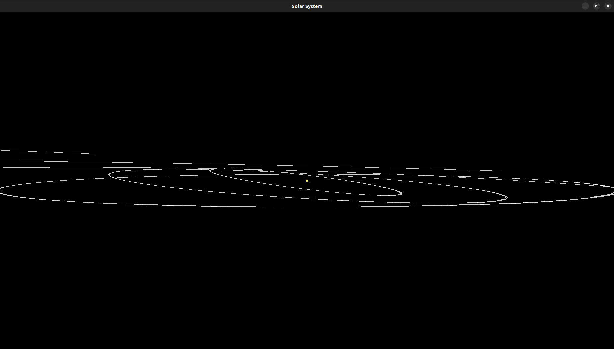
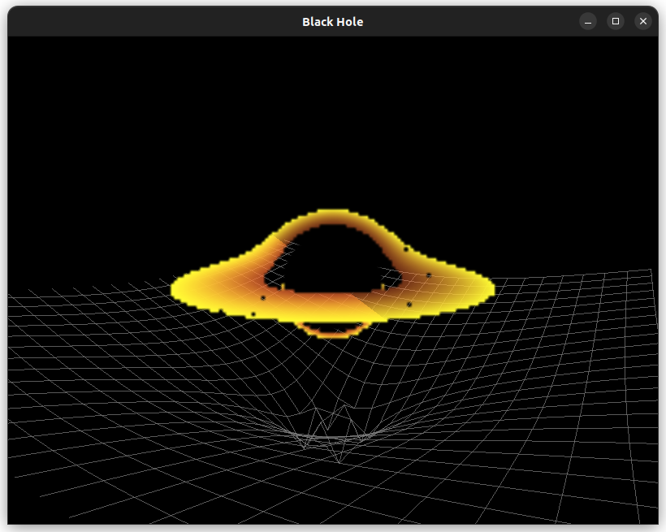
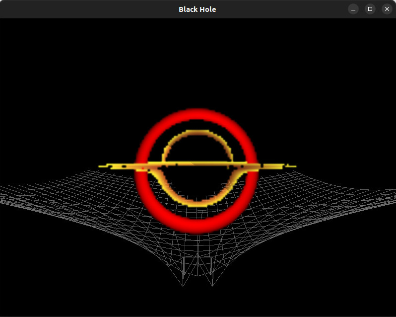

# CosmosGL

A lightweight, C++ N-body gravity simulation and rendering engine powered by OpenGL 4.6.

This project computes the interactions of celestial bodies ranging from terrestrial planets to supermassive black holes using Newton's law of universal gravitation and a modern shader-based pipeline.

---

## Setup

Ensure you have the following libraries installed and linked:

- GLFW3
- GLAD
- GLM

---

## Build & Run
Follow these steps to set up and launch the simulation on your local machine.
1. **Clone the Repository**
   Open your terminal and clone the repo to your local environment:
   ```bash
   git clone https://github.com/Manohara-Ai/CosmosGL.git
   cd CosmosGL
   ```


2. **Verify Shader Paths**

   Ensure the `resources/shaders/` directory contains the required `.vert` and `.frag` files.

3. **Compile the source**
   - Solar System
      ```bash
      g++ src/solarSystem.cpp src/rasterEngine.cpp -lglad -ldl -lGL -lglfw -Iinclude -o build/solarSystem
      ```
   
   - Black Hole
      ```bash 
      g++ src/blackHole.cpp src/rayEngine.cpp -lglad -ldl -lGL -lglfw -Iinclude -o build/blackHole
      ```

4. **Execute**
   - Solar System
      ```bash
      ./build/solarSystem
      ```

   - Black Hole
      ```bash
      ./build/blackHole
      ```
      *Note: ensure your environment is configured to use your Discrete GPU. On Linux, you may need __NV_PRIME_RENDER_OFFLOAD=1 __GLX_VENDOR_LIBRARY_NAME=nvidia or equivalent environment variables.*

### OR

Run the bash script:
- Solar System
   ```bash
   chmod +x solar_system.bash
   ./solar_system.bash
   ```

- Black Hole 
   ```bash
   chmod +x black_hole.bash
   ./black_hole.bash
   ```

---

## Engine API Reference

### 1. Raster Engine — Solar System

**Header:** `rasterEngine.h`

The `Engine` class manages a Newtonian orbital simulation combined with a traditional rasterization pipeline (OpenGL).

### Responsibilities

* Orbital mechanics (Newtonian gravity, circular/elliptical approximations)
* Local rotation of celestial bodies
* Forward rasterization (planets, rings, satellites)
* Star-based lighting inputs for shaders

---

#### Adding Celestial Bodies

##### `addStar`

```cpp
void addStar(std::unique_ptr<Star> star);
```

Registers a light-emitting celestial body.

* Acts as a **point light source** in the lighting shader
* Supports Fresnel-based glow

**Parameters**

* `star` — Owning pointer to a `Star` object

---

##### `addPlanet`

```cpp
Planet* addPlanet(
    float dist,
    float mass,
    float radius,
    glm::vec3 color,
    float rotSpeed,
    float orbitVel,
    float inclination
);
```

Creates and registers a planet orbiting the system barycenter.

**Parameters**

* `dist` — Orbital radius from the star
* `mass` — Planet mass (used for satellites)
* `radius` — Render radius
* `color` — Base albedo
* `rotSpeed` — Local axial rotation speed (rad/s)
* `orbitVel` — Orbital angular velocity (rad/s)
* `inclination` — Orbital plane tilt (radians)

**Returns**

* Pointer to the created `Planet`

---

##### `addSatellite`

```cpp
Planet* addSatellite(
    Planet* parent,
    float dist,
    float mass,
    float radius,
    glm::vec3 color,
    float rotSpeed,
    float orbitVel
);
```

Creates a satellite orbiting a parent planet.

* Initial position and velocity are computed **relative to the parent**
* Inherits the parent's orbital motion

**Parameters**

* `parent` — Planet being orbited
* `dist` — Orbital radius around parent
* `mass` — Satellite mass
* `radius` — Render radius
* `color` — Base albedo
* `rotSpeed` — Local rotation speed
* `orbitVel` — Orbital angular velocity

---

##### `addRing`

```cpp
void addRing(
    Planet* planet,
    float innerRadius,
    float outerRadius,
    glm::vec3 color
);
```

Adds a procedural ring system to a planet.

* Rendered using `GL_TRIANGLE_STRIP`
* Ring geometry is generated in the planet’s local space

**Parameters**

* `planet` — Target planet
* `innerRadius` — Inner ring radius
* `outerRadius` — Outer ring radius
* `color` — Ring color

---

#### Object Structures

##### `Planet`

```cpp
struct Planet {
    std::vector<Ring> rings;
    float rotationSpeed;
};
```

* Stores all associated `Ring` objects
* Handles **local axial rotation**
* Earth-like default rotation speed:

```
7.29 × 10⁻⁵ rad/s
```

---

##### `Star`

```cpp
struct Star {
    float brightness;
};
```

* `brightness` scales light intensity
* Used by Fresnel glow and HDR lighting shaders

---

### 2. Ray Engine — General Relativity

**Header:** `rayEngine.h`

The Ray Engine simulates relativistic light transport using **GLSL Compute Shaders**.

### Responsibilities

* Per-pixel geodesic integration
* Gravitational lensing
* Spacetime curvature visualization
* GPU-driven ray marching

---

#### Compute & Grid API

##### `dispatchCompute`

```cpp
void dispatchCompute(Camera& cam);
```

Executes the compute shader across the full screen.

* Binds camera uniforms
* Dispatches workgroups per pixel
* Solves null geodesics for light rays

**Parameters**

* `cam` — Active camera (position, basis, FOV)

---

##### `generateGrid`

```cpp
void generateGrid(std::vector<Object>& objects);
```

Builds a **spacetime deformation mesh** on the CPU.

* Evaluates gravitational potential at each vertex
* Grid resolution: `100 × 100`
* Used for visualization/debugging of curvature

**Parameters**

* `objects` — Massive objects influencing spacetime

---

##### `drawGrid`

```cpp
void drawGrid(const glm::mat4& viewProj);
```

Renders the spacetime grid overlay.

* Drawn as wireframe using `GL_LINES`
* Transformed by the provided view-projection matrix

**Parameters**

* `viewProj` — Combined camera matrix

--- 

## Technical Overview

### Physics Engine
The core of CosmosGL is a high-precision N-body integrator designed to handle massive scale differences (from Moons to Supermassive Black Holes).

Newtonian Integration: Uses Semi-Implicit Euler integration to calculate gravitational pull between all pairs: $F = G \frac{m_1 m_2}{r^2}$. To maintain stability over long-term orbits, velocity and position updates are processed in discrete time-steps.

Scale Management: Standard float precision is insufficient for Solar System distances. We utilize a logarithmic depth buffer approach and set the far-plane to $10^{21}$ meters (roughly 100,000 light-years) to prevent Z-fighting and geometry disappearance at the edge of the system.

Relativistic Potential: In the Ray Engine, gravity isn't just a force; it's a spacetime deformation. The "Grid" visualization uses the Schwarzschild metric to "dip" the mesh, where the vertical displacement $z$ at point $(x,y)$ is proportional to the sum of the gravitational potentials: $\Phi = \sum \frac{-GM}{r}$.


### Rendering Architecture
#### 1. The Raster Pipeline (Planetary Rendering)
- Procedural Geometry: Spheres are generated using a stack/slice algorithm ($50 \times 50$ resolution). Rings are generated as flat disks using addRing(), which calculates inner and outer radii.

- Ring Shaders: Rings use a custom fragment shader that calculates the distance from the center. A sin function based on this distance creates the characteristic "gaps" and "bands" seen in Saturn's rings.

- Atmospheric Glow: A Fresnel-based shader calculates the dot product between the view vector and the surface normal: $1.0 - \text{clamp}(\vec{V} \cdot \vec{N}, 0, 1)$, creating a soft, glowing rim around stars.

- Orbital Trails: A std::deque stores a historical record of position vectors. These are drawn as a GL_LINE_STRIP with a gradient alpha, causing the trail to fade chronologically.


#### 2. The Raytracing Pipeline (Gravitational Lensing)
- Geodesic Solving: The ray is deflected by an angle  
  $\Delta \phi = \frac{4GM}{c^2 b}$, where $b$ is the impact parameter.

- Event Horizon: If a ray's path falls within the Schwarzschild radius ($R_s = \frac{2GM}{c^2}$), the shader terminates the ray and returns absolute black, simulating the point of no return.

---

## Controls

The engine features an interactive orbital camera and focus system:

### Raster Engine — Solar System

| Input | Action |
|------|--------|
| **Left Click + Drag** | Orbit camera around the currently focused body (e.g., Earth, Mars) |
| **Right Click + Drag** | Pan the camera target across the ecliptic plane |
| **Scroll Wheel** | Zoom in / out using logarithmic scaling for astronomical distances |
| **TAB Key** | Cycle focus between the Sun, planets, and moons |

---

### Ray Engine — Black Hole

| Input | Action |
|------|--------|
| **G Key** | Toggle Physics Simulation (Pause / Resume) |
| **Left Click + Drag** | Orbit the singularity (adjusts azimuth and elevation) |
| **Right Mouse Button** | Toggle gravity on / off within the compute simulation |
| **Scroll Wheel** | Adjust camera radial distance from the event horizon |

---


*Saturn from the simulation of our Solar System.*


*Still from the simulation of our Solar System.*


*Sagittarius A star located at center of Milky Way*


*Gravitational Lensing*

---

## Contributing

1. Fork the project  
2. Create a feature branch:
   ```bash
   git checkout -b feature/AmazingFeature
   ```
3. Commit changes:
   ```bash
   git commit -m "Add AmazingFeature"
   ```
4. Push the branch:
   ```bash
   git push origin feature/AmazingFeature
   ```
5. Open a Pull Request

---
